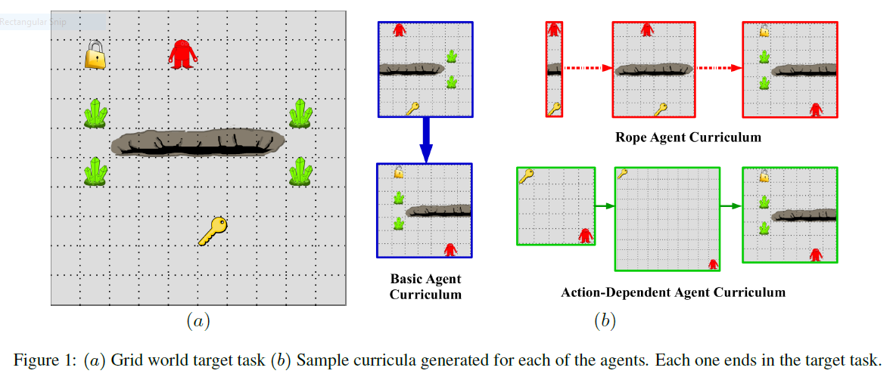
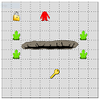
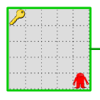
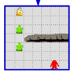

# CLGridWorld
Configurable Curriculum Learning Domain for Reinforcement Learning Agents. As specified by [1]

# Curriculum Learning

Quoted directly from [1]

"As reinforcement learning (RL) agents are challenged to learn increasingly complex tasks, some of these tasks may be in-feasible to learn directly. Various transfer learning methods and frameworks have been proposed that allow an agent to better learn a difficult target task by levering knowledge gained in one or more source tasks [Taylor and Stone, 2009;Lazaric, 2011]. Recently, these ideas have been extended to the problem of curriculum learning, where the goal is to design a curriculum consisting of a sequence of training tasks that are learned by the agent prior to learning the target task."

# Grid World Domain

Quoted directly from [1]



"The world consists of a room, which can contain 4 types of objects. Keys are items the agent can pick up by moving to them and executing a pickup action. These are used to unlock locks. Each lock in a room is dependent on a set of keys. If the agent is holding the right keys, then moving to a lock and executing an unlock action opens the lock. Pits are obstacles placed throughout the domain. If the agent moves into a pit, the episode is terminated. Finally, beacons are landmarks that are placed on the corners of pits. 

The goal of the learning agent is to traverse the world and unlock all the locks. At each time step, the learning agent can move in one of the four cardinal directions, execute a pickup action, or an unlock action. Moving into a wall causes no motion. Sucessfully picking up a key gives a reward of +500, and sucessfully unlocking a lock gives a reward of +1000. Falling into a pit terminates the episode with a reward of -200. All other actions receive a constant step penalty of -10."

# Installation

```bash
git clone https://github.com/LeroyChristopherDunn/CLGridWorld.git
cd CLGridWorld
pip install -e .
```

# Grid World Generation

The GridWorldGenerator can be used to create a variety of grid worlds. All generated grid worlds subclass the gym.Env class from  and therefore can be used in a plug-and-play fashion with various rl agents developed by the community

## Degrees of freedom

Currently the CL grid world has the following degrees of freedom:

- grid size
- player start location
- key location (optional)
- lock location (optional)
- pit start location (optional)
- pit end location (optional)

The degrees of freedom marked as optional, can be excluded from an generated grid world. For instance, a grid world may be created with or without a pit. 

## Rules

In it's standard form, an episode ends when an agent collects all keys and unlocks all locks. If the lock location is not specified to the grid world generator, a grid world without a lock will be generated and the episode will end when the agent collects all keys. If the key location is not specified to the grid generator, a grid world without a key will be generated and the agent will begin the episode with all keys. Either key location, lock location, or both must be passed to the grid world generator. 

Pit start location and end location define the starting and end points of the pit rectangle. Either both locations must be passed to the grid world generator to create a grid world with a pit, or both excluded to created a grid world without a pit.

# Basic Usage

## Grid World Generation

Below are code snippets to generate grid worlds with varying features

### Complete Spec (key, lock, and pit)



```python
from clgridworld.grid_world_builder import GridWorldBuilder, InitialStateParams

params = InitialStateParams(shape=(10, 10), player=(1, 4), key=(7, 5), lock=(1, 1), pit_start=(4, 2),
                            pit_end=(4, 7))    
env = GridWorldBuilder.create(params)
```

### Key Only



```python
from clgridworld.grid_world_builder import GridWorldBuilder, InitialStateParams

params = InitialStateParams(shape=(5, 5), player=(4, 4), key=(0, 0))
env = GridWorldBuilder.create(params)
```

### Lock and Pit



```python
from clgridworld.grid_world_builder import GridWorldBuilder, InitialStateParams

params = InitialStateParams(shape=(7, 7), player=(6, 5), lock=(0, 1), pit_start=(3, 2), pit_end=(3, 6))
env = GridWorldBuilder.create(params)
```

## Example Agents

See the ``examples`` directory.

- Run  to run an simple random agent.
- Run  to run a basic q learning agent with epsilon greedy exploration
- Run  to run a basic q learning agent wiht epsilon decreasing exploration

# State Space

# Todo

# References

[1] Narvekar, Sanmit, Jivko Sinapov, and Peter Stone. "Autonomous Task Sequencing for Customized Curriculum Design in Reinforcement Learning." IJCAI. 2017.


